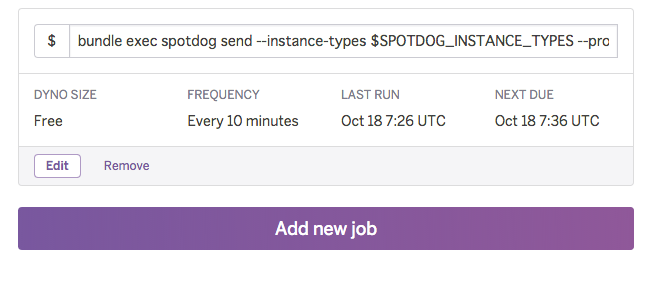

# spotdog-heroku

A template to deploy [Spotdog](https://github.com/dtan4/spotdog) to Heroku

## Current versions

- Ruby 2.2.3
- Spotdog 0.2.1

## Deploy to Heroku

### 1. Press "Deploy to Heroku" button

### 2. Fill the environment variables

You need to set __AWS credentials__ and __Datadog API key__ as environment variables.

- `AWS_ACCESS_KEY_ID`
- `AWS_SECRET_ACCESS_KEY`
- `AWS_DEFAULT_REGION`
- `DATADOG_API_KEY`

### 3. Create application

### 4. Configure scheduler

Add new job as below. `--instance-types` and `--product-descriptions` can be set as you like.

- Command:
  - `bundle exec spotdog send --instance-types c4.xlarge --product-descriptions linux_vpc --last-minutes 10`
- Frequency:
  - Every 10 minutes

### 5. Start monitoring Spot Instance pricing :tada:

